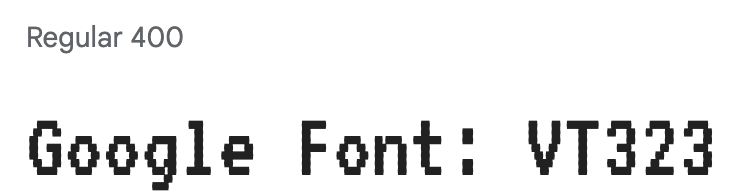
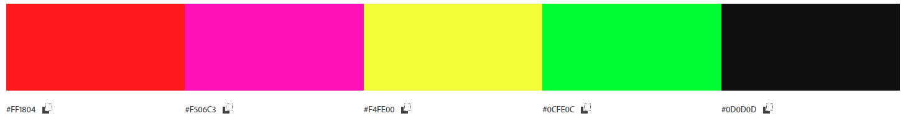
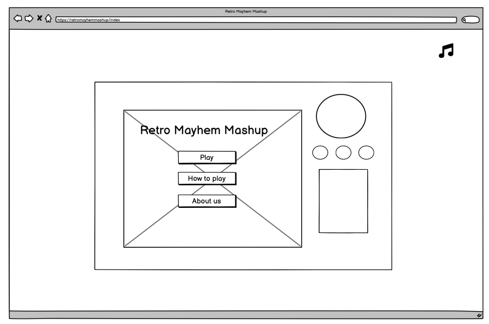
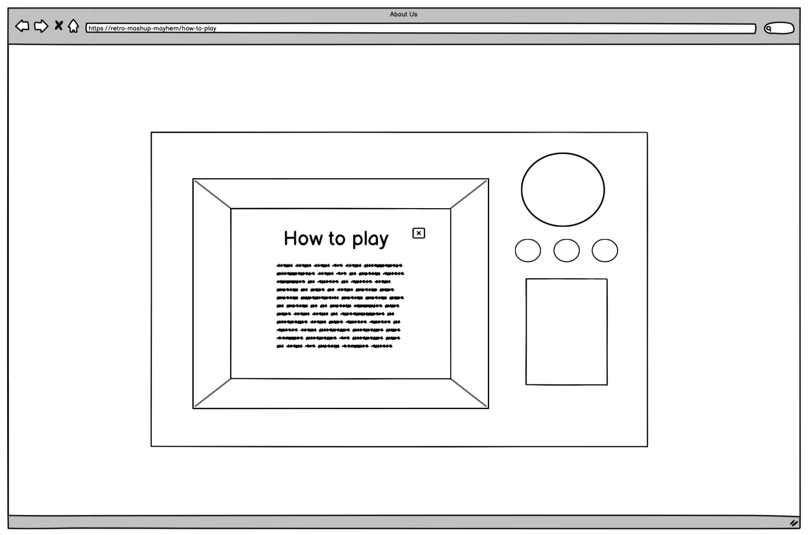
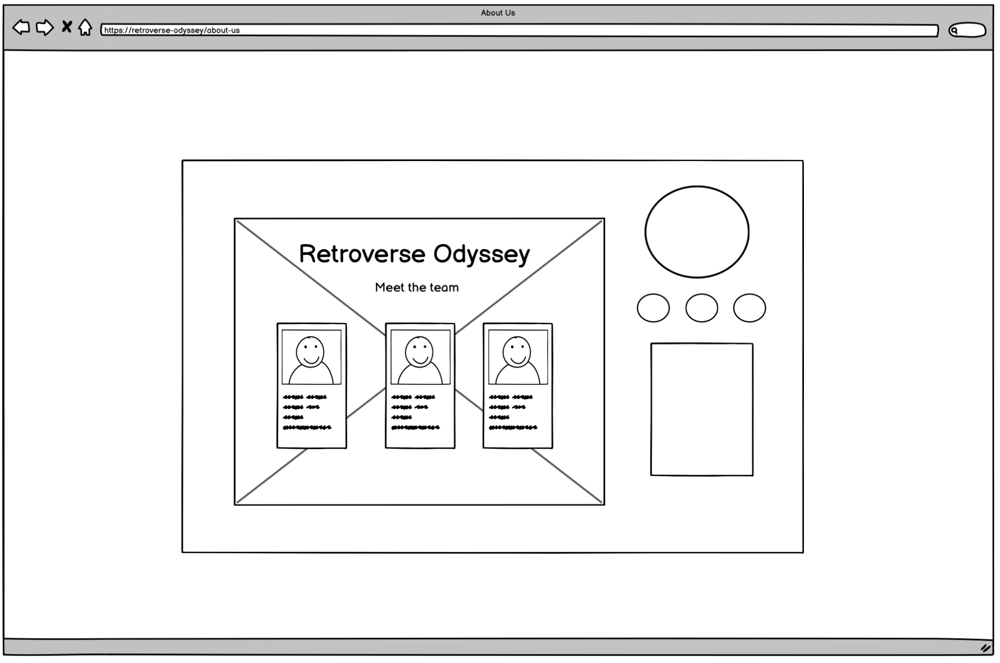
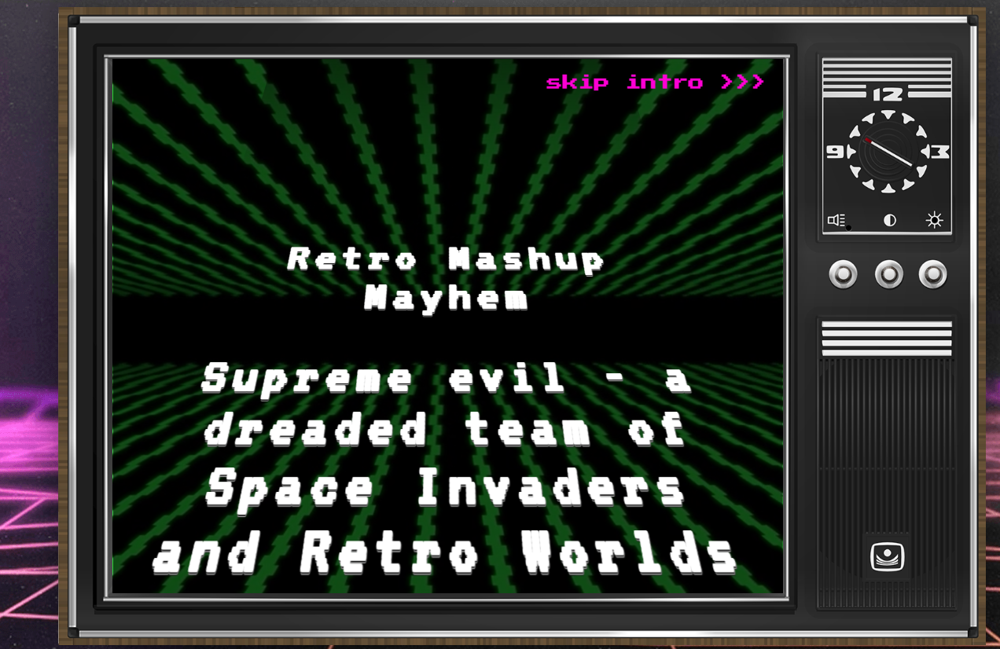

# Retro-Mashup-Mayhem

Welcome to Retro-Mashup-Mayhem game!

      

 ***                                    

# Table of Contents

1. [Overview](#overview)
2. [User Experience](#user-experience)
    - [Game Goals](#game-goals)
    - [User Stories](#user-stories)
    - [Design Structure](#design-structure)
    - [Typography and Color Scheme](#typography-and-color-scheme)
    - [Wireframes](#wireframes)
3. [Features](#features)
    - [Existing Features](#existing-features)
    - [Future Features](#future-features)
4. [Technologies](#technologies)
5. [Controls](#controls)
   + [Game Controls](#game-controls)
6. [Deployment](#deployment) 
7. [Citation of Sources](#citation-of-sources) 
   + [Content](#content)
   + [Media]()
8. [Acknowledgements](#acknowledgment) 

***

# Overview

"Retro-Mashup-Mayhem - Blast Through Time" captures the essence of classic retro games while infusing it with modern flair. The pixel art style, synthesized sound effects, and challenging gameplay harken back to the golden age of arcade games, offering players an authentic and thrilling experience. With its engaging mechanics and a quest for high scores, this game invites players to embark on an unforgettable journey through time. Will you be the one to conquer the retro odyssey and etch your name into the annals of gaming history? 
Retro-Mashup-Mayhem is targeted at people with the love playing games especially classic retro inspired enthusiasts.

Retro games can evoke feelings of nostalgia for those who grew up playing games from previous decades. They allow players to relive fond memories and experiences from their youth.

The pixel art and limited color palettes of retro games can create a distinct visual style that resonates with players who appreciate the aesthetics of the past.

While different people play retro game for various reasons, retro offers the opportunity to explore the history of gaming. Regardless of the reasons, retro games offer a distinct and valuable experience within the gaming world.

# User Experience

## Game Goals

- Problem Statement: A dreaded team of Space Invaders and Retro Worlds enemies have captured our beloved retro heroes. 
- You must overcome menacing foes, and face the formidable Bowser in a cosmic showdown.

Defeat the Enemies: Players must navigate through various time periods, combating waves of enemies with precise shooting and evasive maneuvers. Each defeated enemy contributes to the player's score and progression.

Unlock Power: Scattered throughout the levels are powerful artifacts that, when collected, restore the player's health or provide temporary invincibility. Players must strategically manage their power-ups to maximize their survival chances.

Side-Scrolling Adventure: The game follows a side-scrolling format, immersing players in visually captivating environments as they journey through different eras. Careful navigation and quick reflexes are essential to overcoming obstacles and adversaries.

Reach the High Score: The primary goal is to achieve the highest possible score by eliminating enemies and successfully progressing through the levels. Players can compete against their own best scores or challenge friends to top the leaderboard.

Limited Lives: Players begin with a limited number of lives. Colliding with enemies or environmental hazards reduces their life count. Efficiently using power-ups and mastering evasion tactics are vital for survival.

Level Progression: As players defeat enemies and traverse through levels, the game becomes progressively more challenging. New enemy types and obstacles are introduced, requiring players to adapt and refine their strategies.

Random Movement: Enemies exhibit unpredictable movement patterns, ensuring that each encounter remains fresh and demanding. This randomness adds an element of surprise, making it necessary for players to stay alert and adaptive.

## User Stories

-   I can intuitively navigate around the site so that I can find content.
-   I can see an intro animation so I can feel immersed in the retro experience.
-   I want to be greeted with a Homepage that displays a menu of options to easily access information about the game and have a seamless level selection experience so that I can understand the game's mechanics and progress through levels efficiently.
-   I can move and shoot so that I can avoid and kill enemies
-   I can press shoot so that I can fire projectiles at oncoming enemies.
-   I can see a victory or defeat screen so that I know when the level is over.
-   I want to find information about the developers so that I can request connections or give feedback.

## Design Structure

The game was designed with a simplistic retro strucrure, with clear and easy to follow instruction, that will allow user easily navigate across the program.

## Typography and Color Scheme

-   Google Fonts was used for the following:

-   Press Start 2P was used for the body.
-   VT323 was used for the intro.

The chosen color palette is a vibrant tribute to the neon-lit arcades of the 80s. Drawing inspiration from an iconic image of Space Invaders from that era, the colors are a direct nod to the luminescent hues of the game's enemies. The palette includes:

Red: #EE1B14  
Neon Pink: #FF00D4  
Bright Yellow: #F3FD09  
Neon Green: #27EF10  
Electric Purple: #8801F3   
These colors not only encapsulate the nostalgic retro feel but also infuse energy and dynamism into the design.

## Wireframes

[Back to the Top](#contents)

---

# Features

## Existing Features

### Title and Introductory Page

+ The introductory page is displayed as soon as the program start to run

### ## Menu Page

+ Menu Page display the menu where user: 

  + Can click to display the game rules. 
  + Prompted to displayed the game stage. 
  + Can view the about us page, where the team information can be found.

## Future Features

# Technologies

## Language and Programs used is as follow:

-   Html
-   Css
-   JavaScript
    -   Kaboom: A JavaScript Library
-   Git - Was used for version control, the Gitpod terminal to commit and push to GitHub.
-   GitHub - Was used to store the project code in a repository.

# 5. Controls

### Game Control - Player moves using the following arrows to:

- ⬆️: Move forward
- ⬇️: Move backward
- ⬅️: Move left
- ➡️: Move right
- `Spacebar`: For shooting
- Keep an eye on the life span progress bar
- Kill the boss to save the heroes and earn a reward.
- Move up level after each victory.

# 6. Deployment

# 7. Citation of Sources

## Content

- [Kaboom](https://kaboomjs.com/) - Used for general knowldege and idea.
- [Ourcade](https://www.youtube.com/watch?v=ICGSu5yjQrU&t=719s) - Tips for Getting Started with Kaboom.
- [Andelrodis](https://andelrodis.itch.io/) - Explored for inspiration and game mechanics insights.
- [Spriters-Resource](https://www.spriters-resource.com/) - Utilized for sprite references and artistic direction.
- [Canva](https://www.canva.com/) - Leveraged for graphic design and visual enhancements.

- All content have been by Team4 - Retro Riders.

# 8. Acknowledgements
- 

